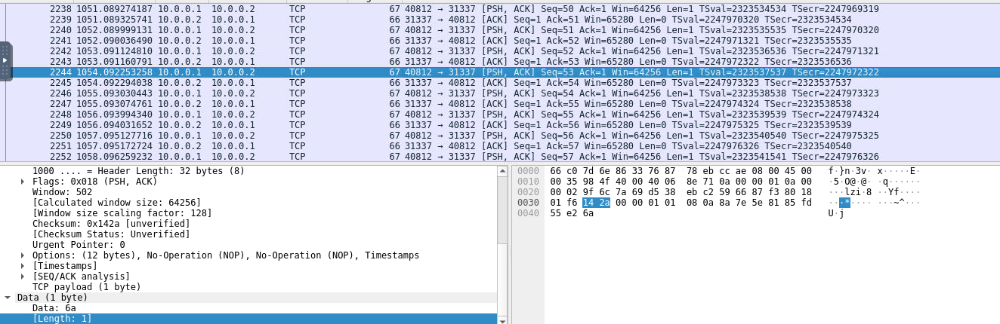
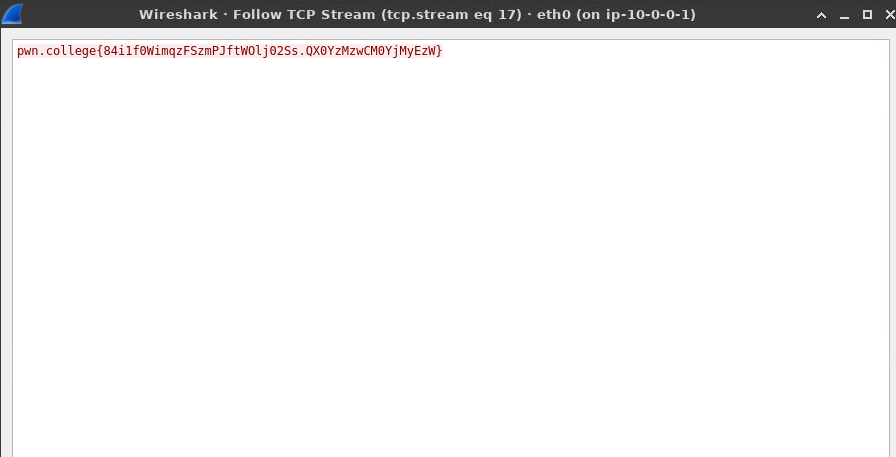

# Problem

# Solution

1. Found the data size of TCP packets are all 1.

2. Follow TCP stream to view the data of TCP packets in the order of TCP stream

> Note: "Follow TCP Stream" is a wireshark feature

